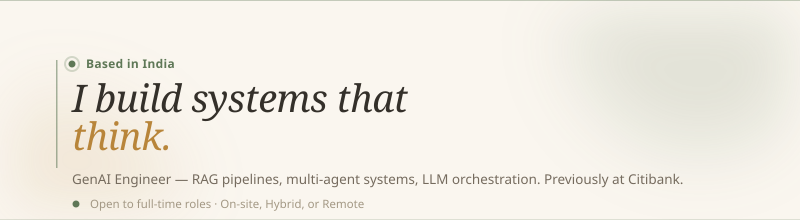

 

**Amit Baghel** · Agra, India
[Portfolio](https://abaghel06.github.io/) · [Email](mailto:amit.baghel.agra@gmail.com) · [LinkedIn](https://linkedin.com/in/abaghel06)

I design and build LLM-based systems — retrieval pipelines, multi-agent workflows, orchestration layers — for problems that don't fold neatly into if/else rules. Four years automating compliance workflows at Citibank taught me how those problems actually break in production, which is what I bring to AI engineering now.

 

### What I work on

- 🤖 **LLM Applications** — retrieval-augmented generation, prompt design, agentic workflows
- 🏗️ **AI-Powered Automation** — replacing brittle rule engines with agents that reason about context
- 🔗 **Multi-Agent Systems** — agents that plan, use tools, and hand work off to each other

 

### Stack

 

### Projects

**[LoanIQ — Intelligent Loan Approval Assistant](https://github.com/abaghel06/LoanIQ---Intelligent-Load-Approval-Assistant)**
A pipeline of four specialised agents — profiling, risk, decision, compliance — evaluate a loan application end-to-end and return a structured verdict, not a black box.
*LangGraph · Claude · FastMCP*

**[Revenue Leakage Finder](https://github.com/abaghel06/Revenue_leak_finder)**
Surfaces billing anomalies manual audits miss — unbilled usage, mispriced line items, payments that failed silently.
*LangGraph · Amazon Bedrock · FastAPI*

**[Food Recommendation System](https://github.com/abaghel06/Food-Recommendation-System)**
Semantic search plus RAG over nutritional data, so "what's like this but higher in protein?" gets a real answer.
*LangChain · ChromaDB · FAISS*

<strong>More projects</strong>

 

**[Indian CA RAG](https://github.com/abaghel06/indian-ca-rag)** — Answers Indian tax and compliance questions by retrieving from a dedicated knowledge base instead of guessing. *LangChain · RAG*

**[AI Meeting Notes Assistant](https://github.com/abaghel06/ai-meeting-notes-assistant)** — Turns a meeting recording into a transcript, cleaned-up terminology, and an actual task list. *Whisper · LangChain · Gradio*

**[YouTube Video Summarizer](https://github.com/abaghel06/youtube-video-summarizer)** — Drop in a video URL, get a summary or ask follow-up questions answered straight from the transcript. *LangChain · FAISS*

 

---

Building something in GenAI, automation, or agentic systems? I'd like to hear about it.
[amit.baghel.agra@gmail.com](mailto:amit.baghel.agra@gmail.com) · [Portfolio](https://abaghel06.github.io/)
